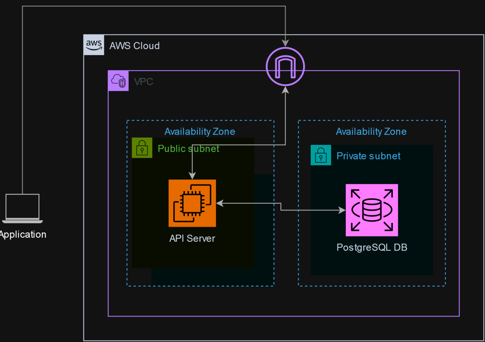

<!-- ABOUT THE PROJECT -->
# AzubiChatbot
AzubiChatbot is a simple python FAQ chatbot with a Tkinter powered GUI that backed by an AWS RDS database via a Django/DRF based API server.

### Collaborations
This is a hand-on cloud engineering project delivered by the azubi africa cloud team in 2023. After 6 months of AWS cloud training and front-end development, we got a chance to work on some realife cloud projects. 
I was able to work with:
 1. Emmanuel Derrick-Brown Akolbire - [LinkedIn](https://www.linkedin.com/in/emmanuel-derrick-brown-akolbire)
 2. Segla Ghislain
 3. Joseph Nsiah
 4. Farouk Salihi
 5. Ogbomo Festus

## Project Overview
#### Technologies
- Python 3.10
- Django/Django Rest Framework
- Terraform
- AWS

#### Application
The AzubiChatBot application is a python based application that utilises the Tkinter module to create a GUI that includes a text area to display user queries as well the chatbot responses and actions and an input text field for user input. The user input is used to generate a request to the Chatbot API server which returns the appropriate response.

#### API server
The Chatbot API server is a Django/DRF based server running on a public EC2 instance in the AWS cloud that responds to user queries and requests. It connects to and manages a database in a private AWS RDS postgresql server which is queried to generate the appropriate response to a request. The server also runs an admin page to allows easy management of records in the database via the Django ORM.

  

### The Architecture
<a href="https://github.com/paryee/AzubiChatbot">
    
</a>

<p align="right">(<a href="#readme-top">back to top</a>)</p>


<!-- GETTING STARTED -->
## Getting Started

This is an example of how you may give instructions on setting up your project locally.
To get a local copy up and running follow these simple example steps.


### Installation
1. Clone the repo
```sh
   git clone https://github.com/your_username_/Project-Name.git
```
2. Navigate to the `terraform` folder
   ```sh
   cd src/terraform
   ```
3. Initialize terraform
```sh
terraform init
```
4. Apply the terraform files. Enter the variable values when asked or create a `terraform.tfvars` file
```sh
terraform apply
```
5. SSH into the EC2 instance and clone the repo
6. Navigate to the api folder
```sh
cd src/api
```
7. Create a `.env` file and specify the following environment variables
```sh
DB_USER=<DB username>
DB_PASSWORD=<DB password>
DB_NAME=azubichatbot
DB_HOST=<DB instance endpoint>
DB_PORT=5432
```
8. Install the requirements
```sh
sudo pip install -r requirements.txt
```
9. Start the server
```sh
sudo python manage.py migrate & sudo python manage.py runserver 0.0.0.0:80
```
10. Locally, navigate to the `app` directory
11. Install the requirements
```sh
sudo pip install -r requirements.txt
```
12. Start the application
```sh
python chatbot.py
```
<p align="right">(<a href="#readme-top">back to top</a>)</p>
